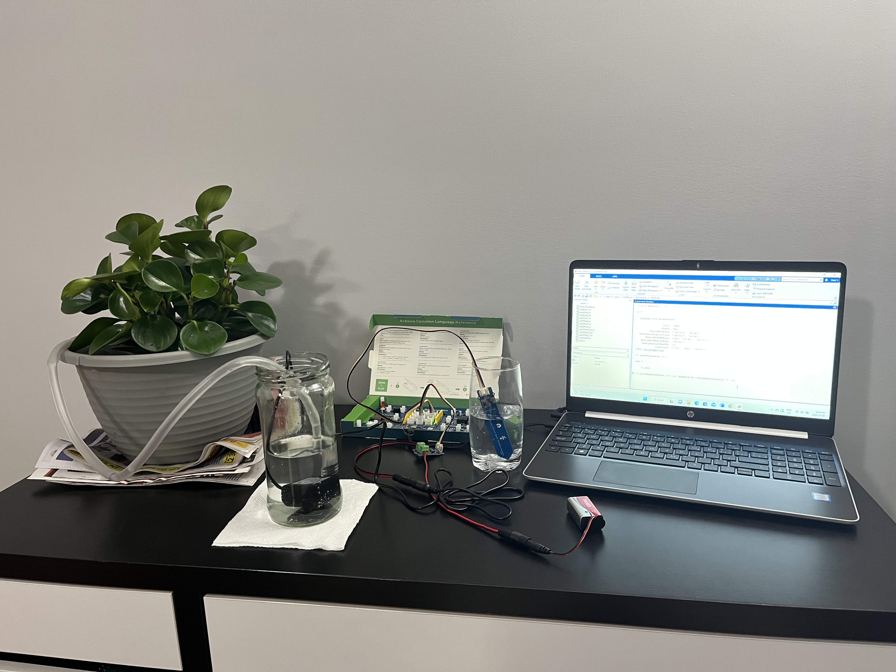

# 🌱 Automatic Plant Watering Machine

This project is a simple Arduino-based system that automatically waters plants by monitoring soil moisture levels. It includes a live voltage vs. time graph and uses a HashMap to log readings over time.

## 🔧 Hardware Components and Their Roles

### 🌿 Moisture Sensor
- Detects soil moisture level.
- Sends analog signals to the Arduino.
- Helps determine when the plant needs watering.

### ⚙️ MOSFET (Transistor Switch)
- Acts as an electronic switch.
- Controls the power supplied to the water pump.
- Triggered by the Arduino to pump water only when needed.

### 🧠 Arduino Board (with Firmata)
- Acts as the brain of the system.
- Reads data from the moisture sensor.
- Sends control signals to the MOSFET and water pump.
- Communicates with the PC for live graphing using Java and StdDraw.

### 💧 Water Pump
- Activates when moisture levels are low.
- Delivers water to the plant via a tube or pipe.

### 🔋 9V Battery
- Powers the entire circuit.
- Portable power solution for small setups.

### 📟 SSD1306 OLED Display
- Shows live readings of soil moisture.
- Connected via I2C to the Arduino board.

## 💻 Software Features

- **Java-based Control and Visualization:**
  - Uses [Firmata4j](https://github.com/kurbatov/firmata4j) to communicate with the Arduino.
  - Uses `SSD1306` for OLED display integration.
  - Implements `StdDraw` to render a live Voltage vs Time graph.

- **Live Moisture Monitoring:**
  - Timer task reads the moisture level every second.
  - If the reading falls below a threshold, the water pump is activated.

- **Data Graphing:**
  - Voltage readings plotted in real-time using `StdDraw`.
  - Axes labeled with time (seconds) and voltage (V).
  - Voltage readings are stored in a `HashMap<Integer, Long>` for potential data logging or analysis.

## 🧪 How It Works
1. The Arduino reads analog moisture values via pin 15.
2. These values are sent to the Java app via serial connection (COM3).
3. The OLED displays the current moisture level.
4. If the soil is dry:
   - The Java app sends a signal to pin 2.
   - The MOSFET switches on the pump.
5. A live graph of voltage over time is rendered using `StdDraw`.

## 🚀 Future Improvements
- Add water level detection in the tank.
- Log data to CSV for analysis.
- Add a mobile notification or dashboard.
- Optimize power consumption for longer battery life.

## 🧑‍💻 Credits
Built using:
- Java + Firmata4j
- Arduino Uno + Sensors
- StdDraw (from Princeton's IntroCS library)

---

## 🧩 Alternative Implementation

A **simpler version** of this project is also available using **MATLAB**.  
Refer to the `MinorProjectAhnaf.m` file for the MATLAB implementation.
